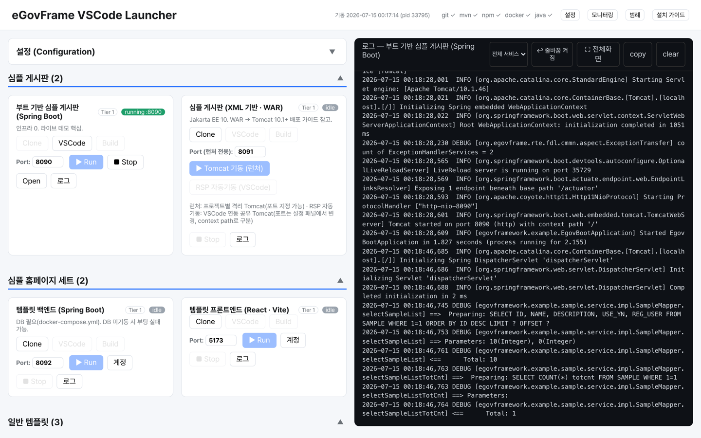
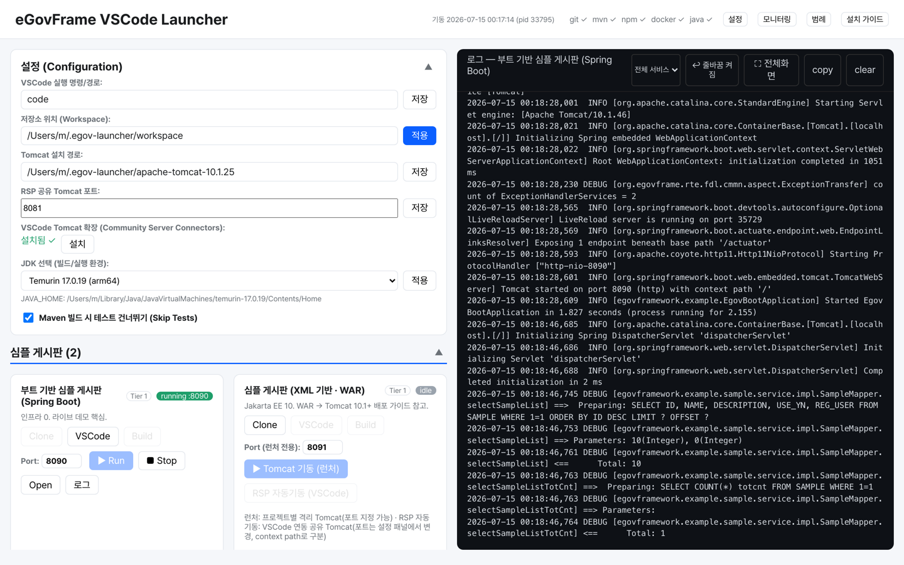
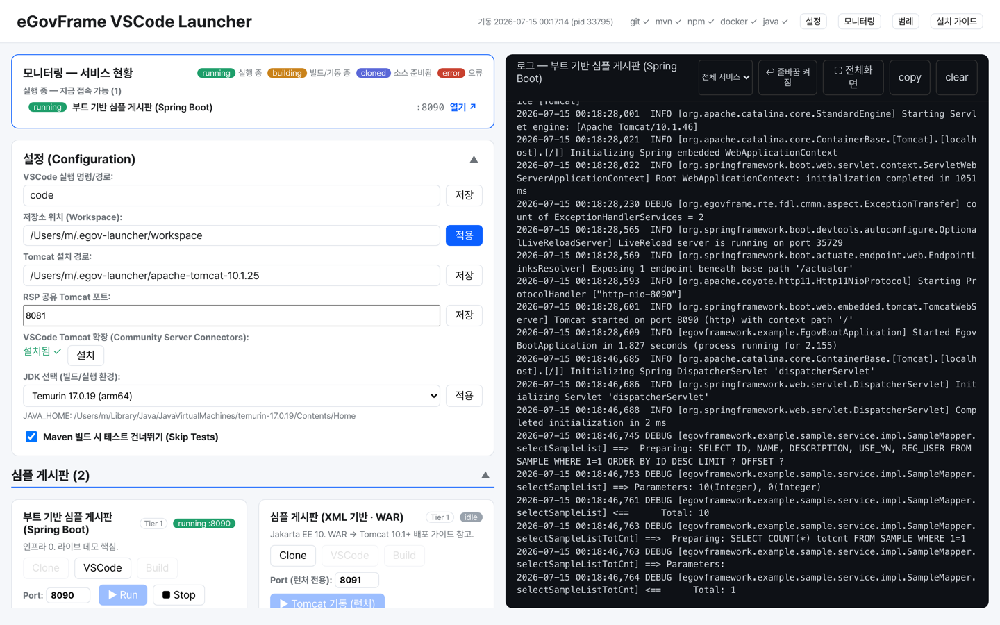

# eGovFrame Launcher


전자정부 표준프레임워크(eGovFrame) 예제 프로젝트를 **clone → build → 기동 → 접속**까지
버튼 몇 번으로 처리하는 로컬 개발용 GUI 런처입니다.
Go 단일 바이너리로 동작하며, 별도 설치 없이 실행하면 브라우저에 대시보드가 열립니다.

표준프레임워크 예제를 처음 돌려보려면 보통 레포마다 clone 위치를 정하고, JDK 버전을 맞추고,
WAR는 Tomcat에 배포하고, MSA 예제는 DB·메시징 컨테이너를 먼저 띄우고, 포트가 겹치지 않는지
확인해야 합니다. 이 런처는 그 준비 과정을 대신합니다.



## 무엇을 해주는가

| 하는 일 | 설명 |
| :--- | :--- |
| **원클릭 실행** | 카드마다 Clone · Build · Run · Stop · Open · 로그 버튼. Spring Boot 타깃은 Run 하나로 기동까지 끝. |
| **WAR 자동 배포** | `mvn package` 후 **타깃 전용 격리 Tomcat 인스턴스**에 자동 배포. HTTP·shutdown 포트를 자동 할당해 타깃끼리 충돌하지 않음. |
| **인프라 자동 기동** | Docker가 필요한 타깃은 MySQL 8.0 · Redis 7 · RabbitMQ 3을 idempotent하게 프로비저닝(스키마 스크립트 순서대로 자동 적재). |
| **JDK 자동 감지** | 시스템에 설치된 JDK를 스캔해 목록 제공. 기본값 JDK 17, 없으면 최신 메이저로 폴백. |
| **실시간 로그** | 빌드·기동 로그를 SSE로 대시보드에 그대로 스트리밍. 서비스별 필터·전체화면·복사 지원. |
| **포트 충돌 회피** | 타깃별 기본 포트가 지정되어 있고, 카드에서 직접 변경 가능. |
| **VSCode 연동** | 클론된 타깃을 `code`로 바로 열기. Tomcat 연동용 Community Server Connectors 확장 설치 버튼 내장. |

## 빠른 시작

### 방법 A: 릴리스 바이너리 (권장)

[Releases](https://github.com/dasomel/egovframe-launcher/releases)에서 플랫폼에 맞는 파일을 내려받아 실행합니다.

```bash
# macOS (Apple Silicon)
tar -xzf egov-launcher-darwin-arm64.tar.gz
./egov-launcher-darwin-arm64     # http://127.0.0.1:7070 자동 오픈
```

Windows는 `egov-launcher-windows-amd64.zip`을 풀고 `.exe`를 실행하면 됩니다.

### 방법 B: 소스에서 실행

```bash
cd launcher
go run .          # 127.0.0.1:7070
```

실행 옵션:

```
-addr string        수신 주소 (기본 "127.0.0.1:7070")
-workspace string   clone 작업 디렉터리 (기본 ".work")
-no-open            브라우저 자동 오픈 안 함
```

### 방법 C: CLI 셸 스크립트

GUI 없이 헤드리스로 쓰고 싶다면:

```bash
bash scripts/00-check-prereqs.sh   # git/mvn/npm/docker/java 설치 여부 점검
bash scripts/01-clone.sh           # 예제 레포 일괄 clone
bash scripts/10-run-boot-sample.sh # 부트 샘플 기동
```

Windows용 `.ps1` 스크립트도 같은 이름으로 제공됩니다.

## 사전 준비물

타깃마다 필요한 것이 다릅니다. 대시보드 상단에서 각 도구의 설치 여부를 확인할 수 있습니다.

- **필수**: `git`, `JDK 17`(권장), `mvn`
- **React 타깃**: `npm`
- **MSA·AI 타깃**: `docker`
- **WAR 타깃**: Tomcat 10.1+ (설정 패널에서 설치 경로 지정)

## 지원 타깃

| 카테고리 | 타깃 | 기동 방식 | 기본 포트 |
| :--- | :--- | :--- | ---: |
| 심플 게시판 | 부트 기반 심플 게시판 (Spring Boot) | Run 즉시 기동 | 8090 |
| 심플 게시판 | 심플 게시판 (XML 기반 · WAR) | 격리 Tomcat 자동 배포 | 8091 |
| 심플 홈페이지 세트 | 템플릿 백엔드 (Spring Boot) | Run (DB 필요) | 8092 |
| 심플 홈페이지 세트 | 템플릿 프론트엔드 (React · Vite) | Run (백엔드 연동) | 5173 |
| 일반 템플릿 | 포털 사이트 템플릿 (WAR) | 격리 Tomcat 자동 배포 | 8093 |
| 일반 템플릿 | 내부업무 시스템 템플릿 (WAR) | 격리 Tomcat 자동 배포 | 8094 |
| 일반 템플릿 | 심플 홈페이지 템플릿 (WAR) | 격리 Tomcat 자동 배포 | 8095 |
| 공통컴포넌트 & MSA | 공통컴포넌트 (WAR) | 격리 Tomcat 자동 배포 | 8096 |
| 공통컴포넌트 & MSA | MSA 공통컴포넌트 | Config→Eureka→Main→Login→Board→Gateway 순차 자동 기동 | 19000 |
| 공통컴포넌트 & MSA | MSA 템플릿 (교육용) | 백엔드 6서비스 → 프론트엔드 순차 기동 (Docker) | 3000 |

로그인이 필요한 타깃은 카드의 **계정** 버튼에서 테스트 계정을 확인할 수 있습니다.

## 설정

`~/.egov-launcher.json`에 저장되며, 대시보드의 설정 패널에서 바로 편집할 수 있습니다.



| 항목 | 설명 |
| :--- | :--- |
| VSCode 실행 명령/경로 | `code` 명령 위치(자동 감지) |
| 저장소 위치 (Workspace) | 예제를 clone할 디렉터리 |
| Tomcat 설치 경로 | WAR 배포에 사용할 Tomcat 10.1+ 위치 |
| RSP 공유 Tomcat 포트 | VSCode Server Connector 연동 시 쓰는 공유 Tomcat 포트 |
| JDK 선택 | 감지된 JDK 중 빌드·실행에 쓸 버전(기본 17) |
| Skip Tests | Maven 빌드 시 테스트 건너뛰기 |

## 모니터링

지금 무엇이 떠 있고 어느 포트로 접속 가능한지 한눈에 봅니다. 상태 배지를 클릭하면 바로 열립니다.



## 빌드

```bash
cd launcher
make test     # 단위 테스트
make build    # 현재 플랫폼 바이너리
make cross    # macOS(arm64/amd64) · Windows(arm64/amd64) 크로스 빌드 → dist/
```

## 참고 링크

- [eGovFrame 공식 GitHub](https://github.com/eGovFramework)
- [eGovFrame VSCode Initializr 확장](https://github.com/eGovFramework/egovframe-vscode-initializr)
- [표준프레임워크 포털](https://www.egovframe.go.kr)

## 라이선스

Apache License 2.0 — 자세한 내용은 [LICENSE](LICENSE)를 참고하세요.
